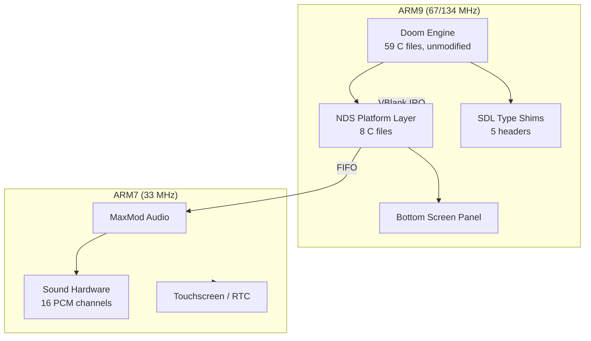

<div align="center">

<br>

# Chocolate Doom DS

**The original Doom on Nintendo DS, built from the real Chocolate Doom source code.**

<br>

[](https://github.com/gufranco/chocolate-doom-ds/actions)
[](COPYING.md)
[]()

</div>

---

**8** NDS platform files  **5** SDL shims  **2,098** lines of NDS code  **33** lines changed in upstream Doom  **576 KB** ROM

## Why This Exists

Chocolate Doom is the gold standard for vanilla-accurate Doom source ports on desktop. It runs on Windows, macOS, and Linux. It does not run on the Nintendo DS.

This project ports Chocolate Doom to the NDS by replacing the SDL platform layer with a minimal NDS-native layer. The Doom engine itself is untouched: the same renderer, the same physics, the same demo compatibility. The NDS layer handles video, input, sound, and timing using libnds and the ARM7 coprocessor.

<table>
<tr>
<td width="50%" valign="top">

### Vanilla Accurate
Same renderer, physics, and demo playback as the original DOS Doom. Zero gameplay modifications.

</td>
<td width="50%" valign="top">

### Minimal Upstream Diff
Only 33 lines changed in Chocolate Doom source. All NDS code is additive, in separate files.

</td>
</tr>
<tr>
<td width="50%" valign="top">

### Fully Dockerized Build
No local toolchain needed. One command builds the ROM inside a BlocksDS Docker container.

</td>
<td width="50%" valign="top">

### DS Lite and DSi
Adaptive memory allocation: 2.5 MB zone on DS Lite, 10 MB on DSi. DSi runs at 134 MHz.

</td>
</tr>
<tr>
<td width="50%" valign="top">

### Live Debug Panel
Bottom screen shows FPS, frame count, zone memory, sound cache, and bug report URL during gameplay.

</td>
<td width="50%" valign="top">

### GDB Debugging
Connect GDB from Docker to melonDS. Full ARM9 register state, backtraces, and NDS memory regions.

</td>
</tr>
</table>

## Architecture



The NDS layer replaces SDL with direct hardware access:

| SDL function | NDS replacement | File |
|:-------------|:----------------|:-----|
| SDL video | VRAM bitmap + affine scaling (320x200 to 256x192) | `i_video_nds.c` |
| SDL audio | `soundPlaySample` via ARM7 MaxMod | `i_sound_nds.c` |
| SDL input | D-pad/buttons + touchscreen to Doom events | `i_input_nds.c` |
| SDL timer | VBlank interrupt counting at 60 Hz | `i_timer_nds.c` |
| SDL headers | Minimal type stubs (no SDL linked) | `src/sdl_shim/` |

## Supported WADs

| WAD | Game |
|:----|:-----|
| `doom1.wad` | Doom Shareware |
| `doom.wad` | Doom (full) |
| `doom2.wad` | Doom II |
| `plutonia.wad` | Final Doom: Plutonia |
| `tnt.wad` | Final Doom: TNT |
| `freedoom1.wad` | Freedoom Phase 1 |
| `freedoom2.wad` | Freedoom Phase 2 |
| `chex.wad` | Chex Quest |
| `hacx.wad` | Hacx |

Place WAD files in `/doom/` on the SD card. One WAD loads automatically. Multiple WADs show a selection menu.

## Quick Start

### Prerequisites

| Tool | Install |
|:-----|:--------|
| Docker | [docker.com](https://www.docker.com/) |
| melonDS | [melonds.kuribo64.net](https://melonds.kuribo64.net/) |

### Build

```bash
git clone git@github.com:gufranco/chocolate-doom-ds.git
cd chocolate-doom-ds
make -f Makefile.nds build
```

### Run

Copy `chocolate_doom_ds.nds` and a WAD file to your flashcart SD card:

```
/doom/doom1.wad
/chocolate_doom_ds.nds
```

Or test in the emulator:

```bash
mkdir -p ~/melonDS_sdcard/doom
cp /path/to/doom1.wad ~/melonDS_sdcard/doom/
cp chocolate_doom_ds.nds ~/melonDS_sdcard/

make -f Makefile.nds run
```

### Controls

| Button | Action |
|:-------|:-------|
| D-pad | Move / Turn |
| A | Fire |
| B | Use / Open |
| X | Run |
| Y | Cycle weapons |
| L / R | Strafe |
| START | Menu |
| SELECT | Automap |
| Touch | Mouse look |

## Development

| Command | Description |
|:--------|:------------|
| `make -f Makefile.nds build` | Build ARM7 + ARM9 + ROM |
| `make -f Makefile.nds debug` | Build with ARM7 exception handler |
| `make -f Makefile.nds clean` | Remove all build artifacts |
| `make -f Makefile.nds run` | Open ROM in melonDS |
| `make -f Makefile.nds gdb` | Connect GDB to melonDS via Docker |
| `make -f Makefile.nds shell` | Interactive shell in build container |
| `make -f Makefile.nds size` | Show ARM7 + ARM9 binary sizes |
| `make -f Makefile.nds disasm` | Dump ARM9 disassembly |

### Debugging

Enable the GDB stub in melonDS (Settings > Devtools > Enable GDB stub, port 3333):

```bash
make -f Makefile.nds run     # start the game
make -f Makefile.nds gdb     # attach debugger
```

GDB loads `.gdbinit` automatically with NDS memory regions and custom commands:

| Command | Description |
|:--------|:------------|
| `nds-regs` | ARM9 register state |
| `nds-bt` | Backtrace (20 frames) |
| `nds-vram` | Dump framebuffer pixels |
| `nds-zone` | Zone allocator free/total |
| `nds-stack` | 32 words at stack pointer |

<details>
<summary><strong>Project structure</strong></summary>

```
arm7/
  source/main.c          ARM7 coprocessor (audio, touch, RTC)
  Makefile               ARM7 build rules
src/
  doom/                  Doom engine (59 files, unmodified)
  nds/
    i_video_nds.c        Video: 320x200 framebuffer, affine scaling
    i_sound_nds.c        Sound: PCM cache, soundPlaySample
    i_input_nds.c        Input: D-pad, buttons, touchscreen
    i_timer_nds.c        Timer: VBlank counting at 60 Hz
    i_system_nds.c       System: zone heap, error handler
    i_main_nds.c         Entry point, WAD selector
    i_stubs_nds.c        Stubs for unused subsystems
    nds_panel.c          Bottom screen HUD
    nds_panel.h          Panel API
  sdl_shim/              SDL type stubs (no SDL linked)
Makefile.arm9            ARM9 build (runs inside Docker)
Makefile.nds             Host-side Docker wrapper
Dockerfile               BlocksDS + gdb-multiarch
docker-compose.yml       Build service with host networking
.gdbinit                 GDB auto-config for NDS debugging
.editorconfig            Code style
```

</details>

## NDS Hardware

| Component | Specification |
|:----------|:-------------|
| Main CPU (ARM9) | ARM946E-S, 67 MHz (134 MHz on DSi) |
| Sub CPU (ARM7) | ARM7TDMI, 33 MHz |
| Main RAM | 4 MB (16 MB on DSi) |
| VRAM | 656 KB |
| Screens | 2 x 256x192 |
| Sound | 16 channels, PCM/ADPCM |

<details>
<summary><strong>FAQ</strong></summary>
<br>

<details>
<summary><strong>Does this work on real hardware?</strong></summary>
<br>

Yes. Flash the ROM and WAD to an SD card, insert into a flashcart (R4, Acekard, etc.), and boot.

</details>

<details>
<summary><strong>Why no music?</strong></summary>
<br>

Doom uses OPL2 FM synthesis for music. The OPL2 emulator needs more CPU than the 67 MHz ARM9 can spare while running the game at 35 fps. OPL on the ARM7 coprocessor is planned.

</details>

<details>
<summary><strong>Why Chocolate Doom?</strong></summary>
<br>

Chocolate Doom prioritizes vanilla accuracy over features. Its clean C codebase and modular platform layer made the NDS port straightforward: replace SDL, keep everything else.

</details>

<details>
<summary><strong>Can I use Heretic, Hexen, or Strife WADs?</strong></summary>
<br>

Not yet. This build compiles only the Doom engine. Heretic, Hexen, and Strife engines exist in the source but are not included in the NDS build.

</details>

</details>

## License

[GPL-2.0](COPYING.md)

Based on [Chocolate Doom](https://github.com/chocolate-doom/chocolate-doom) by Simon Howard and contributors.
